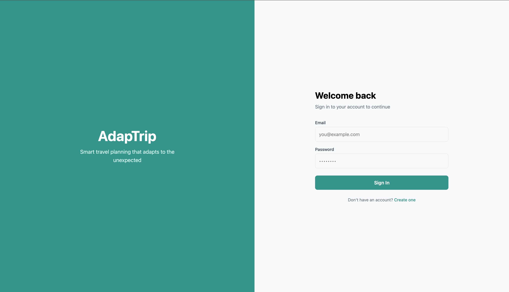
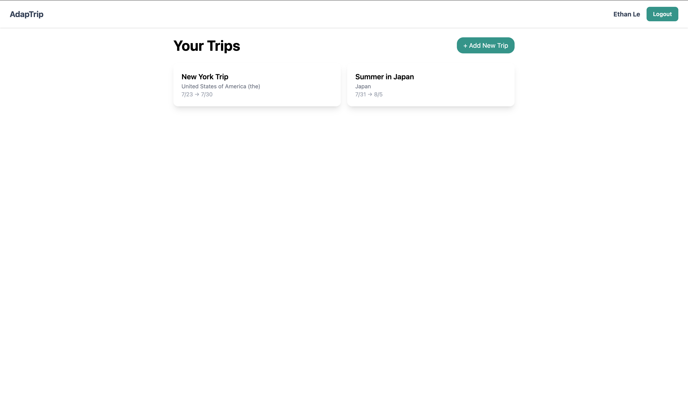
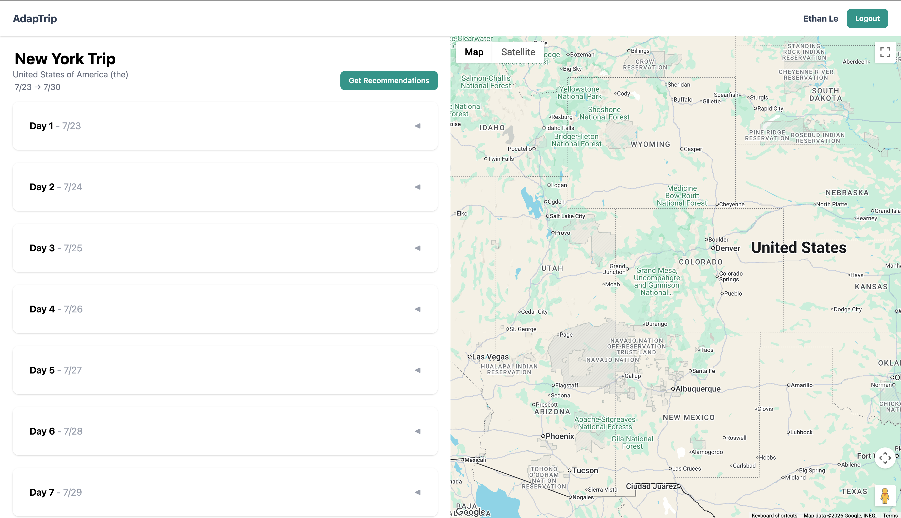
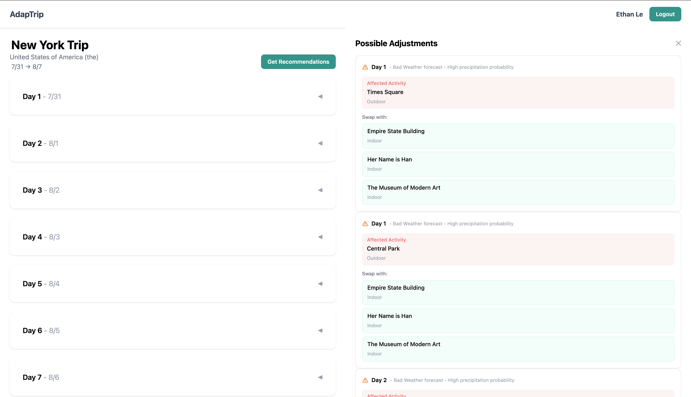

# AdapTrip ✈️

Plan smarter trips with weather-aware itineraries that adapt to your travel plans.

[Live Demo](https://adaptrip.vercel.app)

## Overview
AdapTrip is a travel-planning platform that builds and manages trip itineraries while automatically adapting them based on real-time weather forecasts. Traditional travel-planning tools are static - AdapTrip solves this by comparing scheduled activities to upcoming weather conditions and suggesting intelligent alternatives when weather conflicts arise. The adaptation engine analyzes activity location and category (outdoor/indoor) to filter out options, ensuring that suggestions are practical for your itinerary.

## Screenshots





## Features
- User authentication
- Trip creation and management
- Interactive Google Maps with activity markers
- Google Places activity search
- Inline trip and activity editing
- Weather-driven adaptation engine
- Activity swapping based on weather conflicts

## Tech Stack
### Frontend
- React, TypeScript, Vite
- Tailwind CSS
- Google Maps (@vis.gl/react-google-maps)
- Supabase Auth

### Backend
- Node.js, Express, TypeScript
- Google Places API
- Google Geocoding API
- Open-Meteo Weather API

### Database
- PostgreSQL via Supabase
- Row Level Security

### Deployment
- Frontend → Vercel
- Backend → Railway

## How the Adaptation Engine Works
1. Fetches a weather forecast for the trip destination using Open-Meteo
2. Identifies days with bad weather (rain, snow, thunderstorms) based on WMO weather codes and precipitation probability
3. Finds outdoor activities scheduled on those days
4. Searches for indoor or mixed alternatives already in the itinerary within 10km using the Haversine formula
5. Presents ranked recommendations for the user to accept or dismiss
6. Accepting a recommendation automatically swaps the two activities' days in the database

## Getting Started
### Prerequisites
- Node.js v18+
- Supabase account
- Google Cloud account (Maps, Places, Geocoding APIs enabled)

### Environment Variables
Create `client/.env.local`:
```env
VITE_SUPABASE_URL=your_supabase_url
VITE_SUPABASE_ANON_KEY=your_anon_key
VITE_GOOGLE_MAPS_API_KEY=your_google_maps_key
VITE_API_URL=http://localhost:3001
```

Create `server/.env`:
```env
SUPABASE_URL=your_supabase_url
SUPABASE_SERVICE_KEY=your_service_role_key
GOOGLE_MAPS_API_KEY=your_google_maps_key
PORT=3001
```

### Installation

```bash
# Clone the repo
git clone https://github.com/ethanle-11/adaptrip.git

# Install frontend dependencies
cd client && npm install

# Install backend dependencies
cd ../server && npm install
```

### Running Locally

```bash
# Start frontend (http://localhost:5173)
cd client && npm run dev

# Start backend (http://localhost:3001)
cd server && npm run dev
```

## Future Improvements
- Google Places fallback when no indoor alternatives exist in the itinerary
- Multi-destination trip support
- Trip sharing with other users
- Drag and drop activity reordering within days
